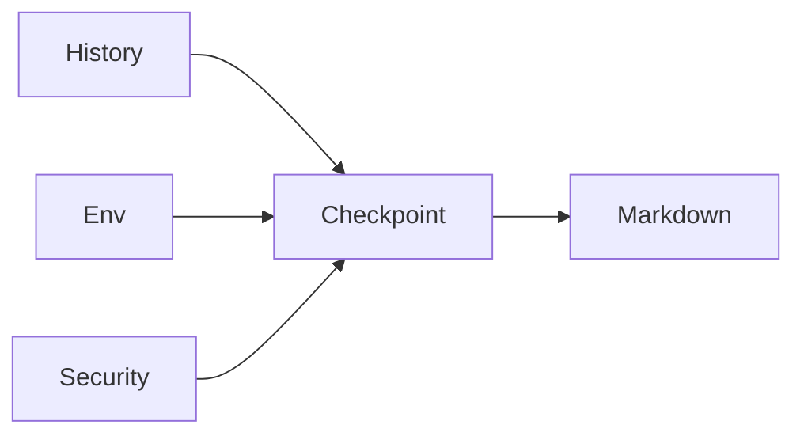

The `session-checkpoint` skill is a state-recovery tool for the Gemini CLI. It gives you a single-command summary of your current project goal and active tool permissions, ensuring you stay in control during complex sessions.
Really I just created this to help me get back into sessions after a squirrel ran by.

![[Pasted image 20260220094525.png]]
## Why Use It?

In long sessions, or when returning to a project after a break or a context switch, it's easy to lose track of the agent's mental model or its active permissions. The checkpoint acts as a human-readable debug log, surfacing context what is usually buried in the system prompt.

### How it Works

The skill pulls data from three sources:
1.  **Session History:** Extracts the active objective from recent turns.
2.  **Environment Audit:** Checks the working directory, active skills, and `GEMINI.md` files.
3.  **Security Context:** Lists available tools and sandbox status.



## Transparency and Security

![[Pasted image 20260220102110.png]]

Transparency is critical when an agent has shell access. The checkpoint explicitly audits your current permissions and the requirement for manual confirmation on every tool action. You always know exactly what the agent can and cannot do.

## Installation (Quick Start)

If you have the Gemini CLI installed, you can add this skill directly from GitHub:

```bash
gemini skill install https://github.com/ReutFarkash/coffeproject/blob/master/skills/session-checkpoint/SKILL.md --path skills/session-checkpoint
```

Once installed, ask the chat for a session-checkpoint for a status update.

## Use Cases

- **"Where was I?"** Resume a task quickly after a break.
- **Permission Auditing:** Verify exactly what tools the agent can use.
- **Conflict Resolution:** Confirm the agent is following the correct `GEMINI.md` mandates.
