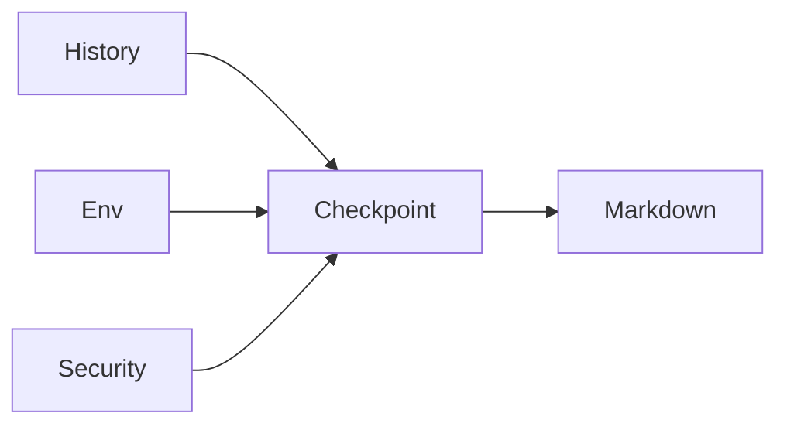

The `session-checkpoint` skill is a state-recovery tool for the Gemini CLI. It provides a single-command summary of your current project goal and active tool permissions, ensuring transparency during complex sessions. 

#### Example output: ![[Pasted image 20260220094525.png]]
## Why Use It?

In long sessions, it's easy to lose track of the agent's current "mental model" or its active permissions. The checkpoint acts as a **human-readable debug log**, surfacing critical context that is usually hidden in the system prompt. This is a really simple skill that I created to help me quickly get back into a chat after a context switch without scrolling through endless prompts and without having to think of every detail I should be interested in on the spot.

### How it Works

The skill aggregates data from three primary sources:
1.  **Session History:** Extracts the active objective from recent turns.
2.  **Environment Audit:** Polls the working directory, active skills, and configuration files (`GEMINI.md`).
3.  **Security Context:** Explicitly lists available tools and sandbox status.



## Transparency and Security

![[Pasted image 20260220102110.png]]

Maintaining transparency is critical when working with agents that have shell access. The checkpoint explicitly audits your current permissions and the requirement for manual user confirmation on every tool action, ensuring you stay in control.

## Installation (Quick Start)

If you have the Gemini CLI installed, you can add this skill directly from GitHub:

> [!TODO] [VERIFY: Ensure the GitHub path below is created and correct before publishing]
```bash
gemini skill install https://github.com/ReutFarkash/gemini-skills --path skills/session-checkpoint
```

Once installed, simply ask your chat for a session-checkpoint to get a status update.

## Use Cases

- **"Where was I?"** Rapidly resume a task after a break.
- **Permission Auditing:** Verify exactly what tools the agent can currently use.
- **Conflict Resolution:** Confirm the agent is reading the correct `GEMINI.md` mandates.
